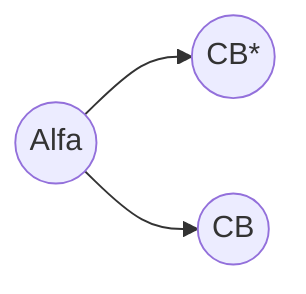
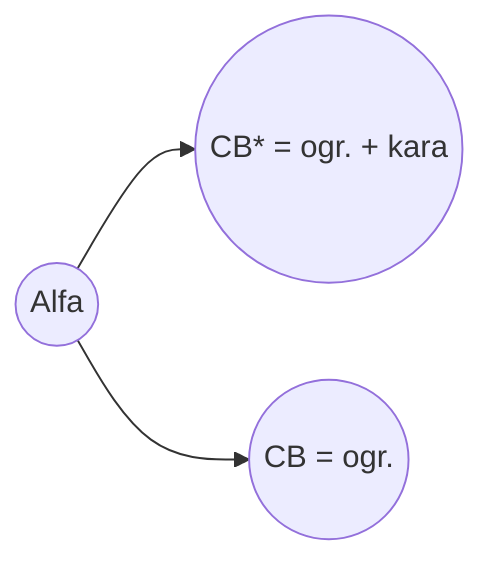
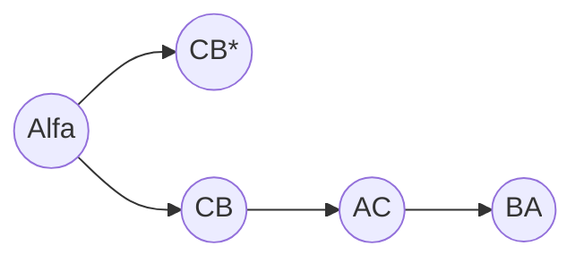

# README #

# Opis krok po kroku jak wygląda algorytm.

## krok 1.
	
- krok 1 metody wegeirskiej.
	- jeśli w wierszach nie ma po 1 zerze, znaleść minimum w każdej kolumnie i odjąć od całego wiersza minimum.
- krok 2 metody wegierskiej.
	- to samo co 1 krok metody węgierskiej, tylko robimy to dla kolumn, znajdujemy minimum dla każdej kolumny.
- wyznaczamy ograniczenie dolne
	- dodajemy do siebie wszystkie minima w wierszach i kolumnach. Dzieki temu wyznaczamy pierwsze ograniczenie.

## krok 2.
	
- Po kolei dla każdego zera ij. patrzymy na wiersz i kolumne w którym zero się znajduje.
Znajdujemy minimum w tym wiersu "i" i kolumnie "j" i dodajemy te 2 wartości minimalne do siebie.

Przykład:
 |ij| A | B | C |
 |--|---|---|---|
A|inf|**0**	 |3	|
B|**0**	 |inf|4	|
C|4	 |**0**	 |inf|
>W tym przykładzie mamy 3 zera na pozycji [1,2],[2,1],[3,2].

- Robimy to dla każdego zera ale nie bierzemy pod uwagę samego zera na przecieciu.
- teraz gdy mamy te wartości, sumujemy je dla każdego zera:

>[1,2] = 3 + 0 = 3
[2,1] = 4 + 4 = 8
[3,2] = 4 + 0 = 4
> [i,j] = min(wiersz) + min(kolumna) = wartość do bilansu zer.
- wyznaczamy max z wyliczonych sum, tak zwaną karę.
>max{3,8,4} = 8.
- wyliczamy drugie ograniczenie dodając nasze max do ograniczenia dolnego wyliczonego w kroku 1. Mamy teraz ograniczenie i ograniczenie z *.

- tworzymy graf/drzewo, pierwszy element 0 ma w sobie ograniczenie, nie ma on oznaczenia.
	- dokładamy kolejne 2 elementy do grafu, jeden z ograniczeniem * i drugi z normalnym ograniczeniem.
	- w tej tablicy bez gwiazdki usuwamy kolumne i wiersz gdzie wystapiła największa suma w kroku 2 :

Lewa macierz w grafie
 |CB*| A | B | C |
 |--|---|---|---|
A|inf|0	 |3	|
B|0	 |inf|4	|
C|4	 |0	 |inf|

Prawa macierz w grafie 
 |CB| A | - | C |
 |--|---|---|---|
A|inf|-	 |3	|
B|0	 |-|4	|
-|-	 |-	 |-|

Graf na tym etapie wyglada nastepująco : 

## krok 3.
Przypisujemy wartość wierzchołkowi w grafie.
> OszacowanieDolne* = OszacowanieDolne + kara 

## krok 4.
- Po usunięciu wiersza i kolumny upewniamy się że na przekątnej znajdują się nieskończonosci :

Prawa macierz w grafie 
 |CB| A | C |
 |--|---|---|
A|inf|3	|
B|0	 |inf	|

## krok 5
- Sprawdzamy czy nowa zredukowana macierz spełnia warunki i posiada zera w każdej kolumnie i wierszu, jeśli nie realizujemy 1 i 2 krok metody wegierskiej.
- Wyznaczamy zmienną **h**, która jest sumą odjętych wartości minimalnych z 1 i 2 krok metody wegierskiej.
> ograniczenie = ograniczenie + h
## krok 6
- Przypisujemy wartosc nowo wyliczonego ograniczeniado grafu :
 ```mermaid
graph LR
A((Alfa ))
A --> B((CB* = ogr. + kara))
A --> C((CB = ogr. + h))
```
## krok 7
- Kiedy tablica ma rozmiar 2x2 i mamy 1 z 2 przypadków:

|ij| A | C |
 |--|---|---|
   A| in|  0| 
   B|  0|inf|
   
lub

|ij| A | C |
 |--|---|---|
   A| 0|  inf| 
   B|  inf|0|
   
   Nastepuje stop algorytmu poprzez przejscie do **kroku 8**.
  - Dodajemy 2 ostatnie elementy do grafu.
Kolejne 2 ostatnie elementy to **AC** i **BA**.




## krok 8

- Sprawdzamy czy ostatni element grafu posiada mniejsze ograniczenie od elementów **ij** i **ij*** wychodzących z **Alfa**. W przykładzie są to elementy **CB** i **CB***
- jeśli element **CB** jest mniejszy od BA przechodzimy do **kroku 2** i konczymy algorytm.
- jeśli element **CB*** jest mnijeszy przechodzimy do **kroku 9**

## krok 9
- W miejsce **CB** wstawiamy **inf**
 
 |CB*| A | B | C |
 |--|---|---|---|
A|inf|0	 |3	|
B|0	 |inf|4	|
C|4	 |**inf** |inf|
	
- Do takiej tablicy realizujemy krok 1 i 2 metody wegierskiej.
- Przechodzimy do **kroku 2**
